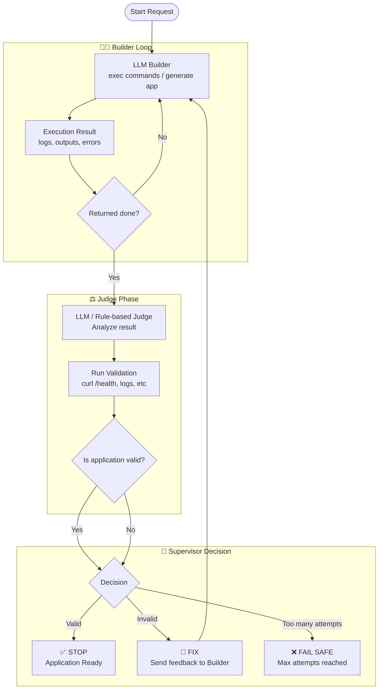

# Inteligencia no OCI OpenAI Proxy

## Conceitos Fundamentais: Builder, Judge e Supervisor

Ao desenvolver sistemas autônomos para criação e execução de aplicações, é essencial separar responsabilidades em três papéis principais: Builder, Judge e Supervisor. Essa divisão permite maior controle, confiabilidade e capacidade de autocorreção.

⸻

### Builder (Executor / Criador)

O Builder é o componente responsável por produzir e executar ações.

Ele interpreta a solicitação do usuário e gera:
* código
* comandos
* configurações
* artefatos da aplicação

No contexto do Proxy, o Builder:
* gera (exec ...) com comandos
* cria aplicações web (FastAPI, frontend, etc.)
* executa ações no ambiente (via subprocess, shell, etc.)

👉 Em resumo:
é quem constrói e tenta resolver o problema

⸻

### Judge (Validador / Avaliador)

O Judge é responsável por avaliar se o resultado produzido pelo Builder está correto e funcional.

Ele pode atuar de duas formas:
* via LLM (analisando contexto, logs, respostas)
* via regras determinísticas (health check, HTTP status, validações)

No Proxy, o Judge orienta:
* executar curl em endpoints
* analisar logs de erro
* verificar se a aplicação responde corretamente
* detectar falhas como ImportError, timeout, etc.

#### Em resumo:
é quem decide se “funcionou de verdade”

⸻

### Supervisor (Orquestrador / Controlador)

O Supervisor é o componente que controla o fluxo geral do sistema.

Ele decide:
* quando continuar executando
* quando corrigir erros
* quando parar definitivamente

Com base no resultado do Judge, o Supervisor:
* encerra o processo (quando válido)
* aciona correções (loop de evolução)
* aplica limites (ex: número máximo de tentativas)

No proxy, isso inclui:
* controle do run_exec_loop
* decisão após (done)
* ativação (ou bloqueio) do evolution engine

👉 Em resumo:
é quem governa o ciclo de vida da execução

⸻

### Como eles trabalham juntos

O fluxo ideal é:
1.	Builder cria e executa
2.	Judge valida o resultado
3.	Supervisor decide:
* parar
* corrigir
* abortar

⸻

### Por que essa separação é importante

Sem essa divisão clara:
* o sistema pode continuar executando indefinidamente
* pode haver correções desnecessárias
* ou pior: aceitar resultados inválidos

Com essa arquitetura:
* você ganha controle determinístico
* reduz alucinação operacional
* e habilita self-healing de verdade

⸻

### Conclusão

Essa estrutura (Builder + Judge + Supervisor) é hoje a base de sistemas avançados de agentes autônomos.

Você já implementou grande parte disso — o próximo passo é apenas formalizar os papéis e definir critérios objetivos de validação e parada.

-----
1. Builder (LLM principal)
* 	Cria a aplicação
* 	Executa comandos
* 	Produz (done ...)

PROMPT BUILDER

⸻

2. Judge (LLM ou regras)

Avalia:
* 	App responde?
* 	Endpoint funciona?
* 	Tem erro crítico?

Exemplo seu (boa ideia):
* 	curl /health
* 	verificar HTTP 200
* 	validar JSON

PROMPT JUDGE

⸻

3. Supervisor

Decide:
* 	Dar como finalizado
* 	corrigir
* 	abortar

PROMPT SUPERVISOR

Diagrama

